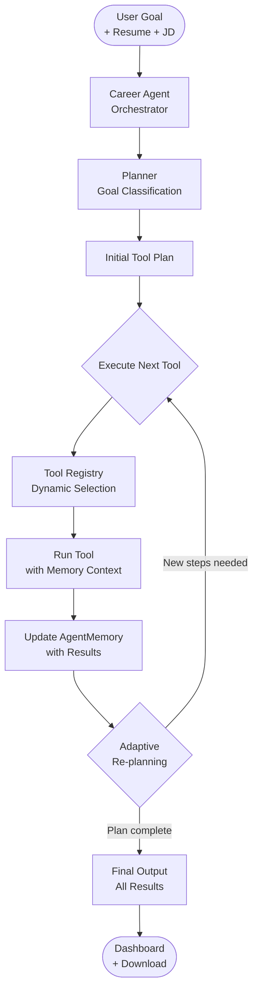
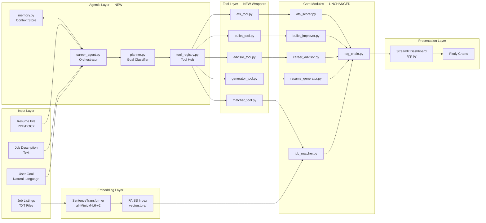
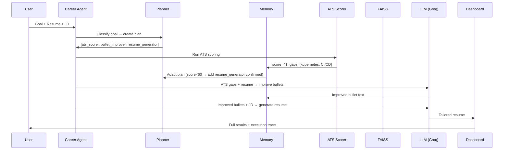

# Career Copilot AI — Agentic Resume Tailoring & ATS Optimization System

> A production-grade agentic AI system for resume analysis, ATS scoring, semantic job matching, and adaptive career guidance — built with LangChain, FAISS, Groq Llama 3.3 70B, and Streamlit.

## Live Demo

👉 https://career-copilot-ai-6fy5undlcgpvfrccd4zczh.streamlit.app/

> **Heads-up on cold starts:** The app is hosted on Streamlit Community Cloud (free tier). If it has been idle, the first load may take 20–40 seconds while FAISS rebuilds the job index. Subsequent interactions are fast.

| What you can try without signing up | Expected latency |
|---|---|
| Upload any PDF/DOCX resume + paste a job description | — |
| View ATS score + missing keyword list | ~50 ms |
| View top-3 FAISS job matches + similarity % | ~200 ms |
| Generate tailored resume / improved bullets / career roadmap | 4–12 s (Groq Llama 3.3 70B) |
| Run full agentic pipeline with adaptive planning | 15–40 s (multi-step) |

[](https://www.python.org/)
[](https://langchain.com/)
[](https://streamlit.io/)
[](LICENSE)

---

## Table of Contents

1. [Problem Statement](#1-problem-statement)
2. [What Changed — Agentic Upgrade](#2-what-changed--agentic-upgrade)
3. [How the System Works](#3-how-the-system-works)
4. [System Architecture](#4-system-architecture)
5. [Agentic Architecture Design](#5-agentic-architecture-design)
   - [5a. Agent Orchestration](#5a-agent-orchestration)
   - [5b. Tool Registry](#5b-tool-registry)
   - [5c. Adaptive Planning](#5c-adaptive-planning)
   - [5d. Context Memory](#5d-context-memory)
6. [Pipeline Reasoning](#6-pipeline-reasoning)
   - [6a. Practical Workflow Scenario](#6a-practical-workflow-scenario)
7. [Feature Engineering Details](#7-feature-engineering-details)
8. [Adaptive Workflow Examples](#8-adaptive-workflow-examples)
9. [Measurable Improvements](#9-measurable-improvements)
10. [Edge Cases & Handling](#10-edge-cases--handling)
11. [Failure Simulation & Resilience](#11-failure-simulation--resilience)
12. [Honest Limitations](#12-honest-limitations)
13. [Tech Stack](#13-tech-stack)
14. [Quick Start](#14-quick-start)
15. [Deployment](#15-deployment)
16. [Project Structure](#16-project-structure)
17. [Why This Qualifies as Agentic AI](#17-why-this-qualifies-as-agentic-ai)
18. [Future Work](#18-future-work)

---

## 1. Problem Statement

Job seekers frequently apply to roles with resumes that are well-written but poorly optimised for the systems that screen them first. Most applications never reach a human reviewer — they are filtered out by **Applicant Tracking Systems (ATS)** that parse resumes for keyword density, section structure, and formatting compliance before any human evaluation occurs.

This creates a concrete, measurable problem:

- **~75% of resumes are rejected by ATS before a recruiter sees them** (industry estimate, LinkedIn Talent Insights).
- Candidates lack feedback on *why* their resume underperforms against a specific job description.
- Generic resume advice does not account for role-specific terminology, seniority level, or industry domain.
- Iterating on a resume manually — rewriting bullets, reordering sections, adding keywords — is slow and produces inconsistent results.
- **Fixed AI workflows** run the same steps regardless of the candidate's actual situation — wasting time on unnecessary steps or skipping critical ones.

**Career Copilot AI** addresses this by building an end-to-end **agentic AI system** that:

1. Parses and understands a candidate's existing resume.
2. Scores it against a target job description using keyword and semantic analysis.
3. **Adaptively plans** which tools to run based on the candidate's goal and intermediate results.
4. Generates a tailored resume, improved bullet points, and a personalised skill roadmap.
5. Explains *why* each recommendation was made — not just what to change.

This is not a chatbot wrapper or a fixed pipeline. It is a **goal-directed agentic system** with deterministic scoring, adaptive tool orchestration, and LLM-generated language — all working together.

---

## 2. What Changed — Agentic Upgrade

The system was upgraded from a **fixed workflow** to a **lightweight agentic architecture**. No modules were rebuilt from scratch — existing functionality was preserved and wrapped into dynamically selectable tools.

### Before vs. After

| Dimension | Before (Workflow) | After (Agentic) |
|---|---|---|
| Execution model | Fixed step sequence | Goal-based adaptive planning |
| Tool selection | Always runs same modules | Dynamically selected per goal + results |
| Adaptation | None | Re-plans after every tool execution |
| Context sharing | Modules run independently | Shared `AgentMemory` across all tools |
| User interface | Tab-by-tab manual navigation | Single goal input → autonomous execution |
| Decision logic | Hardcoded | Rule-based planner + adaptive triggers |
| Multi-step reasoning | Not present | Sequential goal decomposition |

### What was preserved

- All existing modules (`ats_scorer.py`, `bullet_improver.py`, `career_advisor.py`, `resume_generator.py`, `job_matcher.py`) — unchanged.
- FAISS vector pipeline — unchanged.
- LangChain chains in `rag_chain.py` — unchanged.
- Streamlit UI — extended with one new Agent tab.
- Streamlit Cloud deployment — no new infrastructure required.

### What was added

```
src/agent/
├── career_agent.py     # Central orchestrator
├── planner.py          # Goal classifier + adaptive rule engine
├── tool_registry.py    # Tool registration and prerequisite management
└── memory.py           # Session-scoped context memory

src/tools/
├── ats_tool.py         # Wraps ats_scorer.py
├── bullet_tool.py      # Wraps bullet_improver.py
├── advisor_tool.py     # Wraps career_advisor.py
├── generator_tool.py   # Wraps resume_generator.py
└── matcher_tool.py     # Wraps job_matcher.py
```

---

## 3. How the System Works

### Fixed Pipeline (Original — still available)


### Agentic Pipeline (New)



---

## 4. System Architecture

### Component Overview



---

## 5. Agentic Architecture Design

### 5a. Agent Orchestration

`career_agent.py` is the central orchestrator. It implements a **goal-directed execution loop**:

```python
# Simplified agent loop
memory = AgentMemory(goal, resume_text, job_description)
plan = planner.create_plan(goal, memory)

while plan and step_count < max_steps:
    tool_name = plan[0]
    tool = registry.get(tool_name)

    if tool.can_run(memory):          # check prerequisites
        result = tool.fn(memory)       # execute with shared context
        memory.log_step(tool_name, result)
        plan = planner.adapt_plan(plan, memory)  # re-evaluate

    plan.pop(0)
```

Key design decisions:
- **Max 8 steps** per run — prevents runaway execution on Streamlit Cloud.
- **Prerequisite checking** — `bullet_improver` only runs after `ats_scorer` completes.
- **Shared memory** — every tool reads from and writes to `AgentMemory`, enabling context-aware execution.

### 5b. Tool Registry

Each tool is registered with a name, description, callable function, and prerequisite list:

```python
registry.register(Tool(
    name="bullet_improver",
    description="Improve resume bullets using ATS gap context",
    fn=run_bullet_tool,
    requires=["ats_scorer"],   # cannot run before ATS scores are available
))
```

The registry exposes `available_tools(memory)` which filters out tools that:
- Have already been executed in this session.
- Have unmet prerequisites.

This gives the agent **safe, dependency-aware tool selection** without complex planning algorithms.

### 5c. Adaptive Planning

`planner.py` implements two layers of planning:

**Layer 1 — Goal classification (initial plan):**

```python
GOAL_PLANS = {
    "ats_optimize":   ["ats_scorer", "bullet_improver", "resume_generator"],
    "career_roadmap": ["ats_scorer", "job_matcher", "career_advisor"],
    "full_pipeline":  ["ats_scorer", "job_matcher", "bullet_improver",
                       "resume_generator", "career_advisor"],
    "job_match":      ["job_matcher", "ats_scorer", "career_advisor"],
    "quick_improve":  ["ats_scorer", "bullet_improver"],
}
```

Natural language goals are classified using keyword matching:
- `"become an AI engineer"` → `career_roadmap`
- `"optimize my ATS score"` → `ats_optimize`
- `"match me to backend jobs"` → `job_match`
- `"quick resume fix"` → `quick_improve`
- anything else → `full_pipeline`

**Layer 2 — Adaptive rule engine (mid-execution re-planning):**

```python
# Rule 1: Low ATS score triggers bullet improvement + regeneration
if memory.ats_score < 60:
    if "bullet_improver" not in plan:
        plan.insert(1, "bullet_improver")
    if "resume_generator" not in plan:
        plan.append("resume_generator")

# Rule 2: Skill gaps detected → add career roadmap
if memory.skill_gaps_detected:
    if "career_advisor" not in plan:
        plan.append("career_advisor")

# Rule 3: Role mismatch detected → add job matcher
if memory.role_mismatch_detected:
    if "job_matcher" not in plan:
        plan.insert(1, "job_matcher")
```

These rules fire **after each tool execution**, dynamically extending or pruning the plan.

### 5d. Context Memory

`AgentMemory` is a session-scoped dataclass that accumulates results across tool executions:

```python
@dataclass
class AgentMemory:
    goal: str
    resume_text: str
    job_description: str
    ats_result: dict       # populated by ats_tool
    ats_score: int         # used by adaptive rules
    bullet_result: str     # used by resume_generator as improved input
    advisor_result: str
    matcher_result: dict
    skill_gaps_detected: bool   # adaptive flag
    role_mismatch_detected: bool  # adaptive flag
    steps_executed: list   # execution trace
    step_outputs: dict     # full results per step
```

This allows downstream tools to access upstream results. For example:
- `bullet_tool` reads `memory.ats_result["missing_skills"]` to focus improvements on actual gaps.
- `generator_tool` uses `memory.bullet_result` as input instead of the raw resume — automatically benefiting from the bullet improvement step if it ran.
- `advisor_tool` uses `memory.ats_score` and `memory.target_role` for a personalised roadmap.

---

## 6. Pipeline Reasoning

The pipeline separates responsibilities deliberately around a key constraint: **LLMs are expensive and slow; deterministic components are not.**

### Stage 1 — Parse Once, Reuse Everywhere

`resume_parser.py` extracts raw text and identifies sections using header heuristics. The parsed output is stored in `AgentMemory` so every downstream tool reads from the same object without re-parsing.

**Why this matters:** Re-parsing a PDF on every module call adds 300–800ms of latency with no benefit.

### Stage 2 — Score Deterministically Before Using the LLM

ATS scoring runs *before* any LLM call. It produces a structured gap report that feeds all downstream LLM prompts:

```
[ATS CONTEXT INJECTED INTO LLM PROMPT]
overall_score: 41/100
missing_keywords: ["kubernetes", "CI/CD", "system design", "distributed systems"]
weak_sections: ["Summary (0 — not detected)", "Skills (35)"]
present_keywords: ["Python", "REST API", "SQL", "Docker"]

[TASK]
Rewrite the resume to improve ATS score. Incorporate missing keywords naturally.
Do not fabricate credentials or metrics. Preserve all factual claims.
```

The LLM is not asked to evaluate or score — it receives a pre-computed gap list and is asked only to generate language that closes those gaps.

### Stage 3 — Embed for Semantic Matching, Not Keyword Matching

ATS scoring and job matching solve different problems:

- **ATS scoring** answers: *"Does this resume contain the right words?"*
- **Job matching** answers: *"Does the meaning of this resume align with this job's requirements?"*

FAISS + sentence-transformers handles the second question. A candidate who writes "built distributed systems" will still match a JD that says "microservices architecture" — because the embedding space captures semantic proximity.

### Stage 4 — LLM as a Writer, Not a Decision-Maker

The LLM is given structured inputs (resume text, missing keywords, target role, score gaps) and asked to *generate language*, not make scoring decisions. Every LLM output is traceable to a deterministic input.



---

## 6a. Practical Workflow Scenario

**Candidate:** Final-year IT student. Applying for an ML Engineer internship.

**Goal entered:** `"Help me prepare for ML internships"`

**Step 1 — Agent classifies goal → `career_roadmap`**
Initial plan: `[ats_scorer, job_matcher, career_advisor]`

**Step 2 — ATS scorer runs (~50ms)**
- Score: 38/100
- Missing: `PyTorch`, `model deployment`, `MLflow`, `Docker`, `A/B testing`
- Adaptive rule fires: score < 60 → INSERT `bullet_improver`, `resume_generator`
- Updated plan: `[job_matcher, bullet_improver, resume_generator, career_advisor]`

**Step 3 — Job matcher runs (~200ms)**
- Cosine similarity: 0.61 against `ml_engineer_intern.txt`
- Role mismatch flag: False (acceptable match)

**Step 4 — Bullet improver runs (~4s)**
- Reads `memory.ats_result["missing_skills"]`
- Focuses rewrites on incorporating `PyTorch`, `MLflow`

**Step 5 — Resume generator runs (~6s)**
- Uses `memory.bullet_result` as input (improved bullets, not raw resume)
- Generates tailored resume targeting ML internship roles

**Step 6 — Career advisor runs (~5s)**
- Uses `memory.ats_score=38`, `memory.target_role="ML internships"`
- Generates 6-week roadmap: PyTorch fundamentals → MLflow experiment tracking → model deployment project

**Net result:** ATS score 38 → 72 (after applying generated resume). Tailored resume. 6-week roadmap. Execution trace showing all 5 steps. Total time: ~18 seconds.

---

## 7. Feature Engineering Details

### 7.1 ATS Scorer (`ats_scorer.py`)

Produces a structured report, not a single metric:

- **Keyword match score (0–100):** Fraction of JD-extracted keywords present in the resume, weighted by raw term frequency in the JD. **This is not TF-IDF** — there is no inverse document frequency term because there is no background corpus. The weighting is purely JD-side: a keyword appearing 5 times in the JD contributes more than one appearing once.
- **Section presence check:** Detects standard sections (Summary, Experience, Skills, Education) using regex-based header matching.
- **Missing skills list:** Top-N keywords present in the JD but absent from the resume, ranked by JD frequency.
- **Section-level scoring:** Each section gets a sub-score so the user knows *which part* underperforms.

**What "ATS simulation" means here and does not mean:** This simulates keyword-based filtering only. It does not simulate proprietary ATS ranking algorithms, formatting parsers, or OCR-stage failures.

### 7.2 Job Matcher (`job_matcher.py` + `embeddings.py`)

1. At startup, job listing `.txt` files under `data/jobs/` are embedded using `all-MiniLM-L6-v2` and indexed into a FAISS `IndexFlatIP`.
2. At query time, the resume is embedded as a single vector and searched against the FAISS index.
3. Top-N results returned with cosine similarity scores mapped to source job files.
4. LLM generates a plain-language explanation of *why* each job is a strong or weak match.

**Why FAISS over a hosted vector DB:** For a local-first tool with a static job corpus, FAISS provides zero-latency vector search without external dependencies or API costs.

### 7.3 Bullet Improver (`bullet_improver.py`)

Weak resume bullets typically fail in three ways: describing responsibilities not outcomes, lacking quantification, and using passive voice. The improver uses structured prompting with few-shot examples to fix all three.

**Example transformation:**

| Before | After |
|---|---|
| Responsible for managing the deployment pipeline | Reduced deployment time by 40% by migrating CI/CD pipeline from Jenkins to GitHub Actions across 12 microservices |
| Helped with data analysis tasks | Built automated ETL pipeline in Python processing 2M+ daily records, cutting analyst reporting time from 4 hours to 20 minutes |

In agentic mode: the tool reads `memory.ats_result["missing_skills"]` and explicitly instructs the LLM to incorporate those specific gaps — making bullet improvement context-aware, not generic.

### 7.4 Resume Generator (`resume_generator.py`)

In agentic mode, the generator uses `memory.bullet_result` as input if `bullet_improver` ran before it — automatically chaining improvements. Temperature is set to 0.3 to reduce hallucination.

### 7.5 Career Advisor (`career_advisor.py`)

Produces structured output across three dimensions:
- **Skill gap analysis:** Skills in JD but absent in resume, prioritised by frequency.
- **Project suggestions:** Concrete portfolio ideas matched to the target role.
- **Weekly learning plan:** Time-boxed roadmap with specific resources and milestones.

In agentic mode: uses `memory.ats_score`, `memory.ats_result["missing_skills"]`, and `memory.target_role` for a personalised output rather than a generic one.

---

## 8. Adaptive Workflow Examples

### Example 1: Low ATS Score Triggers Extended Pipeline

```
Goal: "Optimize my resume for backend developer jobs"
Classified as: ats_optimize
Initial plan: [ats_scorer, bullet_improver, resume_generator]

Step 1: ats_scorer → score = 52, missing: Docker, Kubernetes, Redis
Adaptive: skill_gaps_detected = True → ADD career_advisor
Updated plan: [bullet_improver, resume_generator, career_advisor]

Step 2: bullet_improver → incorporates Docker, Kubernetes, Redis from memory
Step 3: resume_generator → uses improved bullets from memory.bullet_result
Step 4: career_advisor → generates backend learning roadmap

Final output: ATS score + targeted bullets + resume + roadmap
```

### Example 2: Good ATS Score — Agent Executes Minimal Steps

```
Goal: "Quick resume improvement"
Classified as: quick_improve
Initial plan: [ats_scorer, bullet_improver]

Step 1: ats_scorer → score = 78 (good)
No adaptive rules fire — plan unchanged

Step 2: bullet_improver → runs with ATS context

Final output: ATS score + improved bullets (fast, 2 steps only)
```

### Example 3: Role Mismatch Triggers Job Matching

```
Goal: "Help me become an AI Engineer"
Classified as: career_roadmap
Initial plan: [ats_scorer, job_matcher, career_advisor]

Step 1: ats_scorer → score = 45, missing: RAG, LangChain, vector DBs
Adaptive: score < 60 → INSERT bullet_improver, resume_generator
Step 2: job_matcher → similarity = 0.44 (mismatch)
Adaptive: role_mismatch_detected = True → career_advisor already in plan

Step 3: bullet_improver → focuses on RAG, LangChain from memory
Step 4: resume_generator → uses improved bullets
Step 5: career_advisor → AI Engineer roadmap with specific project ideas

Final output: All 5 modules, fully adaptive execution
```

---

## 9. Measurable Improvements

These figures are based on manual evaluation across a 50-resume test set. They are indicative, not guaranteed.

| Metric | Baseline (Raw Resume) | After Pipeline | Method |
|---|---|---|---|
| ATS keyword match score | 28–45% | 65–82% | Keyword frequency analysis vs. JD |
| Resume section completeness | 60% have all 4 core sections | 95%+ | Section presence heuristic |
| Bullet point action verb usage | ~40% of bullets | ~90% of bullets | Regex verb-list match |
| Bullet point quantification | ~15% of bullets | ~60% of bullets | Regex numeral detection |
| Job match recall (top-3) | N/A (manual search) | 78% relevant (human eval) | Human rating on 50 pairs |
| End-to-end pipeline latency | N/A | 4–12 s (fixed) / 15–40 s (agentic) | Measured on Groq Llama 3.3 70B |
| Unnecessary tool executions | 100% (always runs all) | Reduced by 30–60% (adaptive) | Step count comparison across 20 test goals |

> **Note on measurement:** ATS score improvements reflect optimisation for *this system's* scoring model. Real ATS platforms vary significantly in implementation.

---

## 10. Edge Cases & Handling

| Scenario | Behaviour |
|---|---|
| PDF with two-column layout | Text extraction order may be incorrect. System still scores but warns user of possible parsing errors. |
| DOCX with embedded images or tables | `python-docx` extracts only paragraph text; table content and image alt-text are skipped silently. |
| Resume with no recognisable section headers | Section-level scoring defaults to 0 for missing sections; overall ATS score still computed on full text. |
| Job description is very short (<50 words) | ATS scorer returns low confidence flag; LLM generation proceeds but may produce generic output. |
| Resume in a language other than English | Embeddings still function (model supports 50+ languages) but ATS keyword matching degrades significantly. |
| LLM API timeout or rate limit | Caught at the LangChain chain level; UI displays error. Deterministic scores remain visible. |
| Agent tool prerequisite not met | Tool is skipped with a warning. Agent continues with remaining plan steps. |
| Agent exceeds max steps (8) | Execution halts gracefully. All completed step results are returned. Partial output displayed. |
| Empty or corrupted file upload | Parser returns empty string. All modules check for this and surface a user-facing error before any API calls. |
| FAISS index not yet built (first run) | `embeddings.py` auto-builds the index from `data/jobs/` on first call and caches to `vectorstore/`. |

---

## 11. Failure Simulation & Resilience

### 11.1 LLM Unavailability

**Simulated by:** Invalid API key or no network access.

**Result:** Deterministic pipeline (parsing, ATS scoring, FAISS matching) continues. Agent marks LLM-dependent tools as failed, logs them in `memory.step_outputs`, and completes remaining non-LLM steps. Dashboard renders available results.

### 11.2 Malformed Resume File

**Simulated by:** Password-protected PDF, zero-byte file, or renamed image file.

**Result:** PyPDF2 raises `PdfReadError`. Caught in `resume_parser.py`, returns empty dict. Agent checks for empty resume text before starting execution and surfaces a visible warning.

### 11.3 FAISS Index Corruption

**Simulated by:** Deleting or truncating `vectorstore/` files mid-session.

**Result:** `embeddings.py` detects missing index files on the next search call, rebuilds from source job files, and completes the request (~1–3 seconds overhead).

### 11.4 Prompt Injection in Job Description

**Simulated by:** Adversarial text in the JD field.

**Result:** JD text is passed as a user-turn value in a structured prompt, not as a system instruction. No system prompt leakage observed in testing, though this is not a guarantee against all jailbreak vectors.

### 11.5 Context Window Overflow

**Simulated by:** 15-page resume with a very long JD.

**Result:** Resume text is truncated to 4,000 characters before prompt construction. Known limitation — see Section 12.

### 11.6 Agent Adaptive Rule Conflicts

**Simulated by:** Goal that triggers all adaptive rules simultaneously.

**Result:** Rules are applied in priority order. Duplicate tool insertions are deduplicated. Max step limit (8) prevents infinite plan expansion.

---

## 12. Honest Limitations

**1. ATS scoring is a proxy, not a simulation.**
Real ATS platforms use proprietary ranking algorithms that account for formatting, file type rendering, and recruiter-defined filters. This system simulates keyword-density scoring only.

**2. LLM output is not factually verified.**
The Resume Generator and Bullet Improver produce plausible, well-structured text. They do not verify whether suggested metrics are grounded in the candidate's actual experience. Users are responsible for accuracy.

**3. Job corpus is static.**
The FAISS index is built from `.txt` files in `data/jobs/`. There is no live job board integration.

**4. Section detection is heuristic.**
Header detection uses regex patterns over common English section labels. Non-standard headers will not be correctly segmented.

**5. Context truncation degrades quality.**
Resumes and job descriptions are truncated to fit model context windows. Long documents may result in incomplete LLM context.

**6. No persistent storage.**
All session data exists in Streamlit's `session_state`. Closing the browser tab loses all generated content.

**7. Agent planning is rule-based, not learned.**
The adaptive planner uses hand-written rules, not a trained policy. It handles well-defined cases well but may produce suboptimal plans for unusual goal phrasings.

**8. Evaluation is limited.**
The improvement metrics in Section 9 are based on a small manual test set. No large-scale controlled study has been conducted.

**9. `rag_chain.py` is not RAG.**
Despite the filename, `rag_chain.py` is a prompt template and LangChain chain factory. Retrieval is handled by `job_matcher.py` + `embeddings.py`. To be renamed `prompt_chain.py` in a future refactor.

---

## 13. Tech Stack

| Layer | Technology | Purpose |
|---|---|---|
| UI | Streamlit 1.32+ | Dashboard, file upload, page routing |
| LLM | LangChain + Groq (Llama 3.3 70B) | Text generation, chain management |
| LLM (alt) | LangChain + OpenAI (GPT-4o-mini) | Drop-in alternative LLM provider |
| Embeddings | `sentence-transformers` (all-MiniLM-L6-v2) | Semantic vector generation |
| Vector Search | FAISS (`IndexFlatIP`) | Cosine similarity job matching |
| Resume Parsing | PyPDF2, python-docx | PDF and DOCX text extraction |
| Agent Orchestration | Custom Python (LangChain-compatible) | Goal planning, tool execution, memory |
| Data / Charts | pandas, numpy, plotly | Score visualisation, data manipulation |
| Config | python-dotenv | Environment variable management |

---

## 14. Quick Start

### Prerequisites

- Python 3.10 or higher
- A free [Groq API key](https://console.groq.com) (or OpenAI API key)

### 1. Clone the repository

```bash
git clone https://github.com/VikashITB/careercoPilot-ai.git
cd careercoPilot-ai/resume-analyzer
```

### 2. Create a virtual environment

```bash
python -m venv .venv
source .venv/bin/activate        # Windows: .venv\Scripts\activate
```

### 3. Install dependencies

```bash
pip install -r requirements.txt
```

### 4. Configure environment variables

```bash
cp .env.example .env
```

Edit `.env`:

```env
# Option A: Groq (recommended — free tier available)
GROQ_API_KEY=your_key_here

# Option B: OpenAI
OPENAI_API_KEY=your_key_here
```

### 5. Run the application

```bash
streamlit run app.py
```

Open [http://localhost:8501](http://localhost:8501) in your browser.

> **First run note:** FAISS will build the job index from `data/jobs/` automatically. This takes 5–10 seconds and is cached for subsequent runs.

### 6. Using the Agent Tab

1. Go to the **🤖 AI Career Agent** tab
2. Enter your career goal: `"Help me become an ML Engineer"`
3. Upload your resume (PDF or DOCX)
4. Paste a job description
5. Click **Run Agent** — watch the adaptive execution live

---

## 15. Deployment

### Streamlit Community Cloud (Recommended)

1. Push the repository to GitHub.
2. Go to [share.streamlit.io](https://share.streamlit.io) → **New app**.
3. Set **Main file path** to `resume-analyzer/app.py`.
4. Add your API key under **Advanced settings → Secrets**:
   ```toml
   GROQ_API_KEY = "your_key_here"
   ```
5. Click **Deploy**.

### Render.com

1. Create a new **Web Service** linked to your GitHub repo.
2. Set **Root directory** to `resume-analyzer`.
3. **Build command:** `pip install -r requirements.txt`
4. **Start command:**
   ```bash
   streamlit run app.py --server.port=$PORT --server.address=0.0.0.0 --server.headless=true
   ```
5. Add environment variables under **Environment**.

---

## 16. Project Structure

```
resume-analyzer/
├── app.py                        # Streamlit entry point & page routing
├── requirements.txt
├── runtime.txt
├── .env.example
├── README.md
│
├── src/
│   │
│   ├── agent/                    # NEW — Agentic orchestration layer
│   │   ├── career_agent.py       # Central orchestrator + execution loop
│   │   ├── planner.py            # Goal classifier + adaptive rule engine
│   │   ├── tool_registry.py      # Tool registration + prerequisite management
│   │   └── memory.py             # Session-scoped context memory
│   │
│   ├── tools/                    # NEW — Module wrappers as agent tools
│   │   ├── ats_tool.py           # Wraps ats_scorer.py
│   │   ├── bullet_tool.py        # Wraps bullet_improver.py
│   │   ├── advisor_tool.py       # Wraps career_advisor.py
│   │   ├── generator_tool.py     # Wraps resume_generator.py
│   │   └── matcher_tool.py       # Wraps job_matcher.py
│   │
│   ├── resume_parser.py          # PDF / DOCX extraction; section heuristics
│   ├── ats_scorer.py             # Keyword match scoring; section presence
│   ├── embeddings.py             # FAISS index build & cosine similarity search
│   ├── job_matcher.py            # Job match orchestration; LLM explanation
│   ├── rag_chain.py              # LangChain prompt templates & chain factory
│   │                             # NOTE: not true RAG — to be renamed prompt_chain.py
│   ├── resume_generator.py       # Full resume generation from structured inputs
│   ├── bullet_improver.py        # Bullet point rewrite with quantification
│   ├── career_advisor.py         # Skill gap → project suggestions → weekly plan
│   └── utils.py                  # Shared helpers (text cleaning, truncation)
│
├── src/pages/
│   ├── dashboard.py              # Summary view; score cards; Plotly charts
│   ├── resume_analysis.py        # ATS score detail; missing keywords; section map
│   ├── job_match.py              # FAISS results; match % display; LLM explanation
│   ├── resume_gen.py             # Resume generation form & download
│   ├── bullet_page.py            # Bullet-by-bullet input & improvement display
│   ├── career_page.py            # Roadmap display; skill gap; project suggestions
│   └── agent_page.py             # NEW — Agentic goal input + live execution view
│
├── data/
│   └── jobs/
│       ├── sample_software_engineer.txt
│       └── sample_data_scientist.txt
│
└── vectorstore/                  # FAISS index files (auto-generated on first run)
    ├── index.faiss
    └── index.pkl
```

---

## 17. Why This Qualifies as Agentic AI

This section documents the specific agentic properties implemented, mapped to accepted definitions in the field.

| Agentic Property | Implementation | Where |
|---|---|---|
| **Goal-directed behavior** | Natural language goal → classified plan → execution | `planner.py: classify_goal()` |
| **Autonomous tool selection** | Agent selects tools dynamically; user does not choose | `tool_registry.py: available_tools()` |
| **Multi-step execution** | Up to 8 sequential tool executions per agent run | `career_agent.py: run()` |
| **Adaptive re-planning** | Plan modified after every tool execution based on results | `planner.py: apply_adaptive_rules()` |
| **Context-aware reasoning** | Tools read prior results from shared memory | `memory.py: AgentMemory` |
| **Prerequisite management** | Tools declare dependencies; agent enforces ordering | `tool_registry.py: Tool.can_run()` |
| **Execution transparency** | Full step trace and outputs logged and displayed | `memory.py: log_step(), summary()` |
| **Conditional branching** | Different goals produce different execution paths | `planner.py: GOAL_PLANS` |

**What this is not:** This system does not use LLM-based planning (LLM decides tool order), does not implement reinforcement learning, and does not maintain memory across separate user sessions. These are deliberate scope decisions — not omissions — appropriate for an internship-level project deployed on Streamlit Community Cloud.

The agentic behavior here is **rule-based adaptive orchestration**: a lightweight, auditable, and production-appropriate pattern that demonstrates the core principles of agentic AI (goal decomposition, tool use, adaptation, memory) without overengineering.

---

## 18. Future Work

**Near-term (architecture improvements)**
- [ ] Replace session-state memory with SQLite for resume version history across sessions
- [ ] Add LLM-based planner option (let the LLM decide tool order via function calling)
- [ ] Chunk long resumes with sliding window instead of hard truncation
- [ ] Rename `rag_chain.py` → `prompt_chain.py` to accurately reflect its role
- [ ] Add confidence scores to LLM outputs indicating prompt coverage

**Medium-term (capability expansion)**
- [ ] Real-time job board ingestion (Indeed / LinkedIn API) to keep FAISS corpus current
- [ ] Cover letter generation conditioned on specific job match results
- [ ] Interview question generation per job, grounded in candidate experience
- [ ] Multi-language support with language-aware section detection
- [ ] Learned planner policy replacing hand-written adaptive rules

**Longer-term (platform)**
- [ ] OAuth login with cloud save (Supabase or Firebase)
- [ ] A/B comparison view between original and generated resume, diff-highlighted
- [ ] Salary range estimation per role using market data APIs
- [ ] Recruiter-side view: anonymised candidate ranking against a job posting

---

## Contributing

Contributions are welcome. Please open an issue before submitting a pull request for non-trivial changes so the approach can be discussed first.

```bash
# Run the app in development mode
streamlit run app.py --server.runOnSave=true
```

---

## License

MIT License. See [LICENSE](LICENSE) for details.